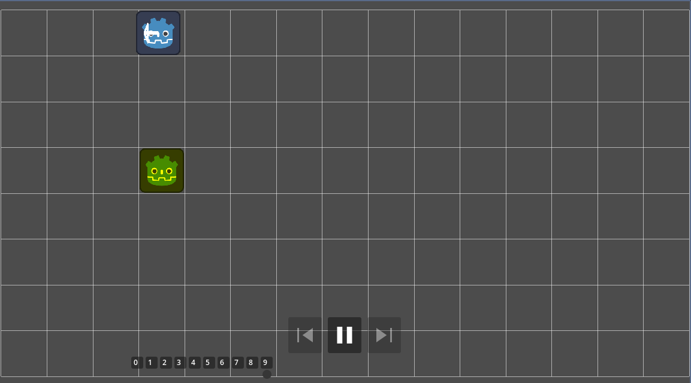
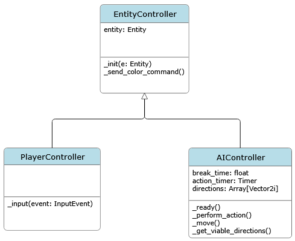
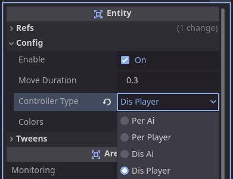
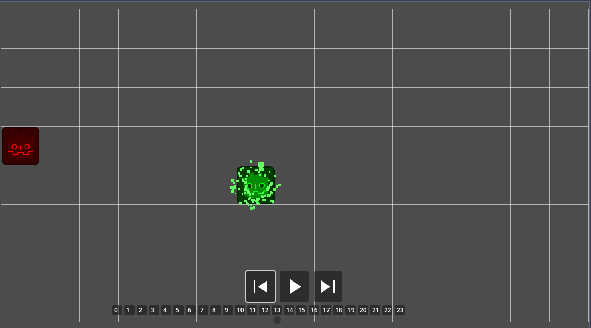

# CommandGodot
A clean example implementation of the Command Pattern in Godot with added visualizations.

**Made in Godot 4.4.1**. If 4.5 adds abstract classes, most of the 'base' classes here can be easily adapted.

Eine deutsche Übersetzung dieser ReadMe gibt es [hier](./docs/German_README.md).

## Usage and Goal
This is meant to be a written tutorial explaining the command pattern for [object-oriented programming](https://en.wikipedia.org/wiki/Object-oriented_programming). \
The main priorities are understanding the purpose, core concept and functionality of the pattern.

The project has been implemented trying to follow the [SOLID](https://en.wikipedia.org/wiki/SOLID) principles of programming and the [GDScript style guide](https://docs.godotengine.org/en/stable/tutorials/scripting/gdscript/gdscript_styleguide.html).


## What is the Command Pattern?
Robert Nystrom's tagline breaks it down to the most essential:
> A command is a reified method call.

He sensibly includes an explanation for 'reify', which boils down to "make something into a thing".

I want to make this understanding even more direct (especially for people familiar with object-oriented programming) with the tagline:
> A command is an object wrapping a method.

To demonstrate, we have a method:
```gdscript
func greet() -> void:
    print("Hello World!")
```
We *could* just shove that into a class and call it a day:
```gdscript
class_name GreetCommand

func greet() -> void:
    print("Hello World!")
```
But now we have only one object that can perform a single specific action, which we always have to reference directly.

Now, while GDScript does not have abstract classes and methods *yet*, it does have inheritance:
```gdscript
class_name Command

func execute() -> void:
    pass
```
```gdscript
class_name GreetCommand
extends Command

func execute() -> void:
    print("Hello World!")
```

> 💡 **Note**: In GDScript, if inheritance is not explicitly defined (no "extends" was used), the class will implicitly extend `RefCounted` (see the [docs](https://docs.godotengine.org/en/stable/tutorials/scripting/gdscript/gdscript_basics.html#inheritance)).

### What is it used for?
Treating a method as an object enables several useful patterns, including **Undo/Redo** Functionality, **Command Queues** and **Scheduling**, and **Macro Commands** (Batch Operations).

Of the SOLID principles, the command pattern innately follows or encourages the Single Responsibility, Open–Closed, and Liskov Substitution principles.

General benefits are:
- **Decoupling**: The object invoking the command doesn't need to know anything about the receiver or how the action is performed.
- **Extensibility**: New commands can be added without changing existing code.

The most direct drawbacks are:
- **Increased code complexity**: Every command operation becomes a new object you have to organize and manage.
- **Potentially more difficult debugging**: Increased decoupling and abstraction can make debugging harder.
- **State Management**: If commands can be undone, storing and restoring their state increases complexity and can be error-prone.

Further examples of the pattern's usage can be found on its [Wikipedia](https://en.wikipedia.org/wiki/Command_pattern#Uses) page.


## Implementing Commands
### Disclaimer
This project uses my own terms of *persistent* and *discrete* commands. 

While this distinction is often used in explanations of the command pattern (see [Wikipedia](https://en.wikipedia.org/wiki/Command_pattern#Terminology) or [Game Programming Patterns](https://gameprogrammingpatterns.com/command.html#undo-and-redo)), a cursory search has not found any cases of this being explicitly named.

### Project Setup
This project aims to demonstrate the pattern by implementing two commands of each type (a `Movement` and a `Color` command), which both affect instances of an `Entity` that moves on a 2D grid. It also implements a simple undo/redo system, which is visualized to decrease cognitive load.



\
To demonstrate decoupling with the command pattern, each type of command has a `PlayerController` and `AIController`, which generate and/or call the commands to influence an Entity. Note that 'AI' here simply refers to a repeating timer that executes a random command on timeout.

So, for each type of command, there is an `EntityController` which contains a reference to the Entity it will control and some base properties and functions (for the implementation, see [PerEntityController](./persistent_commands/per_entity_controller.gd) and [DisEntityController](./discrete_commands/dis_entity_controller.gd)). This base class is extended by a `PlayerController` and `AIController`, which create commands for the entity based on user input and a timer respectively.


> 💡 **Note**: It is best practice in GDScript to prepend an underscore to virtual methods or private methods or properties. See the [style guide](https://docs.godotengine.org/en/stable/tutorials/scripting/gdscript/gdscript_styleguide.html#functions-and-variables).

This setup allows the use of a dropdown to choose between each implementation of an `EntityController` for an entity:



### Persistent Commands
This type of implementation can also be described as single-instance or variable-input commands. When using one, you invoke the same instance of a command repeatedly, giving the method it encapsules its parameters directly.

This commands [base class](./persistent_commands/persistent_command.gd) in this project looks something like this:
```gdscript
class_name PersistentCommand
extends RefCounted

@warning_ignore("unused_parameter")
func execute(entity: Entity, data: Object = null) -> void:
	push_error("Command execute not implemented")
```
> 💡 **Note**: I explicitly inherit `RefCounted` for clarity.

There are several differences from the first example of a command.

`@warning_ignore("unused_parameter")` does what it says: it makes the compiler ignore the `unused_parameter` warning, removing it from the code editor warnings and the debugger. Many people I know find it easy to ignore warnings in those areas, but I like to keep them clean. \
We ignore this warning because `PersistentCommand` is a base class; the `execute` function is meant to be overridden by its child classes and its parameters are meant for exactly those, not for the base class itself. \
That `push_error` is there for the same reason. Since we do not have abstract classes or interfaces, it is useful to have something else tell us if we made a mistake when overriding the function.

Now, for the parameters. In this project’s setup, all planned commands affect an Entity. Handing its reference over like this is an example of [Dependency Injection](https://en.wikipedia.org/wiki/Dependency_injection). \
On the other hand, `data` is for *everything else* a command might need. To keep this as type safe as possible, [inner classes](https://docs.godotengine.org/en/stable/tutorials/scripting/gdscript/gdscript_basics.html#inner-classes) are used to clearly define the data parameters.

For an example, let's look at the persistent command [implementation](./persistent_commands/per_movement_command.gd) for moving an entity:
```gdscript
class_name PerMovementCommand
extends PersistentCommand


func execute(entity: Entity, data: Object = null) -> void:
	if data is not Params:
		push_error("Movement Command did not get the correct Params")
		return;
	
	entity.move((data as Params).direction)


class Params:
	var direction: Vector2i
	
	func _init(dir: Vector2i) -> void:
		direction = dir
``` 
The `Params` class is a small pattern that can be kept consistent for any data parameter a specific persistent command needs. The command call to let an entity move to the right could look like this:
```gdscript
var params = PerMovementCommand.Params.new(Vector2i.RIGHT)
movement_command.execute(entity, params)
```
So this uses the same instance of the `PerMovementCommand` and creates new `Params` for each movement. This instance is set up in the [PerEntityController](./persistent_commands/per_entity_controller.gd) base class:
```gdscript
class_name PerEntityController
extends Node

var entity: Entity

var movement_command := PerMovementCommand.new()
var color_command := PerColorCommand.new()
```
The [PerPlayerController](./persistent_commands/per_player_controller.gd) creates the parameters based on the user input, while the [PerAIController](./persistent_commands/per_ai_controller.gd) picks a random direction it is allowed to move in.

\
**In Summary**
- Instances of persistent commands are created once when the script is loaded
- The same instance is used repeatedly
- That instance's `execute` method is given its parameters each time it is called

While this is more decoupled and extensible than calling a method directly, it does not enable systems like Undo/Redo or Command Queues.


### Discrete Commands
These can also be described as 'instanced commands'. Instead of repeatedly calling the same command instance with different parameters, you create a distinct command instance for each execution. \
Let's look at the differences in the [base class](./discrete_commands/discrete_command.gd):
```gdscript
class_name DiscreteCommand
extends RefCounted

var _entity: Entity

func _init(entity: Entity) -> void:
	_entity = entity

func execute() -> void:
	push_error("Command execute not implemented")

func reverse() -> void:
	push_error("Command reverse not implemented")

```
With this type of implementation, a single command is only ever meant to use a single set of parameters. Hence, those are not injected with the function call itself, but with the constructor `_init`. \
Just like the `entity` parameter was separate from the `data` parameter for the `PersistentCommand`, here the `_entity` property is directly declared in the base class.

Having the parameters of a command saved in the command instance gives you the ability to execute it in reverse. \
The `MovementCommand` [implementation](./discrete_commands/dis_movement_command.gd) for discrete commands serves as an example here:
```gdscript
class_name DisMovementCommand
extends DiscreteCommand

var _direction: Vector2i

func _init(entity: Entity, direction: Vector2i) -> void:
	super(entity)
	_direction = direction

func execute() -> void:
	_entity.move(_direction)

func reverse() -> void:
	_entity.move(-_direction)
```
> 💡 **Note**: The `super` keyword inside an overridden function lets you call that function of the inherited class. Inherited classes in GDScript are not called "base" or "parent" classes, but `super classes`. See the [docs](https://docs.godotengine.org/en/stable/tutorials/scripting/gdscript/gdscript_basics.html#inheritance).

Since `_direction` is a simple 2D vector, it can be easily reversed.

The [command](./discrete_commands/dis_color_command.gd) to change the Entity color needed an additional property to enable this:
```gdscript
class_name DisColorCommand
extends DiscreteCommand

var _picked_color: Color
var _previous_color: Color

func _init(entity: Entity, color: Color) -> void:
	super(entity)
	_picked_color = color

func execute() -> void:
	_previous_color = _entity.get_sprite_color()
	_entity.set_sprite_color(_picked_color)

func reverse() -> void:
	_entity.set_sprite_color(_previous_color)
```


### Undo/Redo
With instanced, discrete commands that have a method to reverse their execution, we already have most of what we need for a basic Undo/Redo System. \
To determine which commands to reverse, we need to keep track of them as they are executed. For this, we can implement an undo stack:
```gdscript
const MAX_STACK_LENGTH: int = 30

var _current_index: int
var _executed_commands: Array[DiscreteCommand] = []
```

> 💡 **Note**: "Stack" describes a data structure (here an Array) that is treated like a literal stack of something. You place something on top of the stack and take from the top of the stack (the [First-In-First-Out](https://www.geeksforgeeks.org/dsa/lifo-last-in-first-out-approach-in-programming/) approach). GDScript supports such a workflow with built-in methods like `append()` and `pop_back()` (see the [docs](https://docs.godotengine.org/en/stable/classes/class_array.html)).

While a limit like `MAX_STACK_LENGTH` should always be implemented, it’s intentionally small here to make the stack easier to visualize in the UI.

If we wanted to *only* undo commands, we would indeed use `Array.pop_back()` and forget any commands that were undone. However, since we also want to redo commands, we instead remember the `_current_index` we are at. This means:
- when we undo a command, `_current_index` moves 1 lower in the stack.
- when we redo a command, it moves 1 higher in the stack.
- when we execute a *new* command while *not at the top* of the stack, everything in front of `_current_index` is discarded and the new command is added.

As mentioned, the project includes a visualization of the undo stack that is shown when the `ControllerType` of any Entity is set to an implementation of the [DisEntityController](./discrete_commands/dis_entity_controller.gd).\
In [Project Setup](#project-setup) you can see the visualization as the undo stack fills.

Here it is after some commands were undone:

The grey circle representing `_current_index` shows our current position in the undo stack. 

Let's look at the command creation of the [DisPlayerController](./discrete_commands/dis_player_controller.gd) as an example:
```gdscript
func _input(event: InputEvent) -> void:
	if event.is_echo():
		return
	if !entity.enable:
		return

	var command: DiscreteCommand
	var direction := Vector2i(-2, -2)
	if event.is_action_pressed("up"):
		direction = Vector2i.UP
	elif event.is_action_pressed("down"):
		direction = Vector2i.DOWN
	elif event.is_action_pressed("left"):
		direction = Vector2i.LEFT
	elif event.is_action_pressed("right"):
		direction = Vector2i.RIGHT
	elif event.is_action_pressed("color"):
		command = _send_color_command()
	
	if direction != Vector2i(-2, -2):
		if !entity.can_move_in_direction(direction):
			return
		else:
			command = DisMovementCommand.new(entity, direction)
	
	if command == null:
		return
	
	# Execute command
	command.execute()
	
	# Add created command instance to list of executed commands
	UndoManager.add_executed(command)
```
To sum it up:\
When a movement direction or the 'color' action (set to spacebar in the project settings) is triggered, a new [DiscreteCommand](./discrete_commands/discrete_command.gd) instance is created and assigned to the `command` local variable. Of course, if the entity cannot move in the picked direction (because it is at the border of the grid) or the input was not any of those checked (resulting in `command` being null), the function returns without doing anything.

For the detailed undo/redo implementation, see the [UndoManager](./discrete_commands/undo_manager.gd).